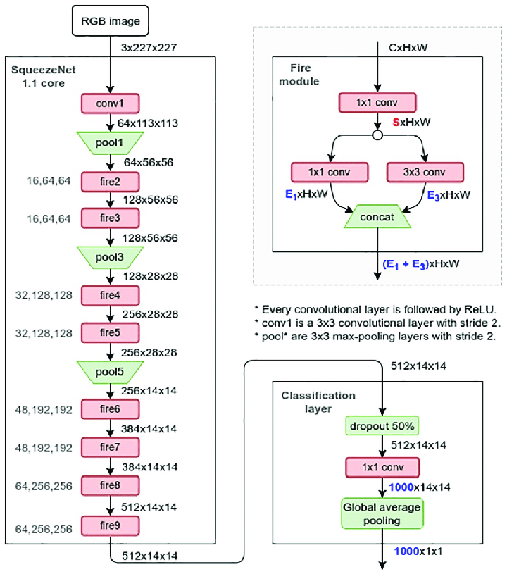
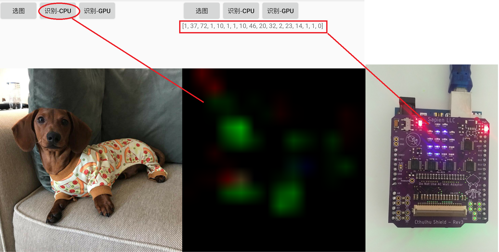

# ncnn-android-squeezenet-cthulhu

The squeezenet image classification 

this is a sample ncnn android project, it depends on ncnn library only

## how to build and run
### step1
https://github.com/Tencent/ncnn/releases

* Download ncnn-YYYYMMDD-android-vulkan.zip or build ncnn for android yourself
* Extract ncnn-YYYYMMDD-android-vulkan.zip into **app/src/main/jni** and change the **ncnn_DIR** path to yours in **app/src/main/jni/CMakeLists.txt**

### step2
* Open this project with Android Studio, build it and enjoy!

## screenshot

## channels

