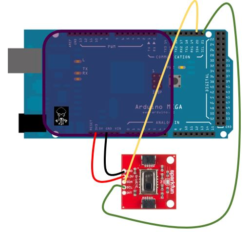

readme and instructions to be posted in the next few days

# About Mega_Heat_Cam_with_Shield
This example illustrates the use of the Cthulhu as a sensory substitution device paired with the Quicc GRID-Eye Infrared Array to sense the warmth of objects. When a warm object is sensed by the Infrared Array, the LEDs on the Cthulhu will light up, and the corresponding electrodes on the removable flexible array will be stimulated.

# Quicc GRID-Eye Infrared Array setup with mega and Cthulhu Shield 
```
On Qwicc GRID-Eye       On Cthulhu Shield/Arduino MEGA
 Infrared Array	
    GND	                            GND
    3.3V	                    3.3V
    SDA	                        Pin 20 (SDA)
    SCL	                        Pin 21 (SCL)
```



