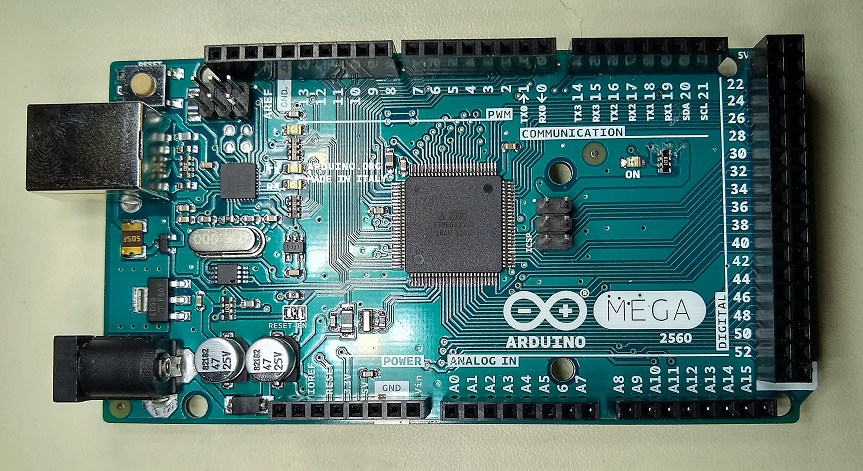

# About Mega_Heat_Cam_with_Shield
This example illustrates the use of the Cthulhu as a sensory substitution device paired with the Quicc GRID-Eye Infrared Array to sense the warmth of objects. When a warm object is sensed by the Infrared Array, the LEDs on the Cthulhu will light up, and the corresponding electrodes on the removable flexible array will be stimulated.

# Required Materials:

* Cthulhu Shield

* Arduino Mega or compatible clone

* SparkFun Grid-EYE Infrared Array Breakout - AMG8833 (Qwiic)

* USB A to B Cable

* One 18 Channel flexible electrode array from Sapien LLC

# Quicc GRID-Eye Infrared Array setup with mega and Cthulhu Shield 

On Qwicc GRID-Eye Infrared Array  |    On Cthulhu Shield/Arduino MEGA
----------------------------------|----------------------------------
GND	            |                GND
3.3V	           |                3.3V
SDA	            |            Pin 20 (SDA)
SCL	            |            Pin 21 (SCL)

# Libraries
For this example you will need to download the [GridEYE Library](https://github.com/sparkfun/SparkFun_GridEYE_Arduino_Library).

If you do not know how to install an Arduino library, refer to the "How to Use this Repository" section [in the README](https://github.com/SapienLLCdev/Cthulhu).

