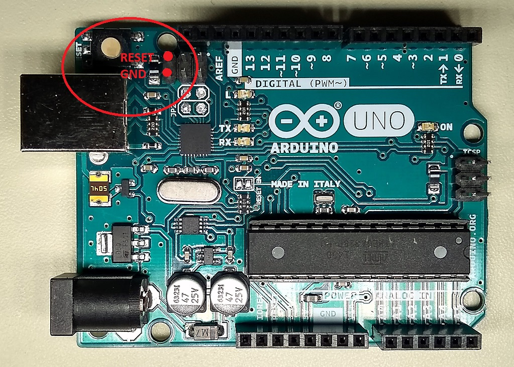

## Using the Cthulhu Shield and Arduino Uno to send Keystrokes

# Introduction:

The Cthulhu Shield and electrode array can be used to sense whether or not your tongue is in contact with certain electrodes. Combined with the electrotactile ability of the Cthulhu Shield, this can be used to create 'virtual' tactile buttons that can be pressed with the tongue. With some minor software hacking of the Arduino, we can get the Arduino-Cthulhu to tell the computer that it is a keyboard and send keystrokes to your computer with your tongue.

# Required Materials:

* Cthulhu Shield

* Arduino Uno or Mega or compatible clone with Atmega16U2 as USB to UART converter (it sounds like older boards using the Atmega8U2 may also work)

* USB A to B Cable

* One 18 Channel flexible electrode array from Sapien LLC

# Required Software:
* This library
* [Arduino IDE](https://www.arduino.cc/en/Main/Software)
* [Flip programmer](https://www.microchip.com/developmenttools/ProductDetails/flip)

# Hardware Assembly:
Install Cthulhu Shield onto Arduino Uno or Arduino Mega and attach the USB cable and electrode array. 

# Example:
Once you have installed the Cthulhu Shield library go to **file**>**examples**>**Cthulhu-master** and open the **tactile_keypad** example sketch.

Set your board and serial port from the **tools** dropdown menu and upload the sketch to your Arduino Uno or Mega.

Once you have downloaded the [Flip programmer](https://www.microchip.com/developmenttools/ProductDetails/flip), open the progam and select the ATmega16U2 device by selecting the IC icon in the upper left of the window. 

With the Arduino powered, short these two pins together to put the ATmega16U2 into a state that allows to reprogram it.

Click the USB cable icon in the upper left and select the 'USB' option from the dropdown. 

# Going Further:

# Acknowledgments: 
Inspiration for this project and Firmware for Atmega16U2 come directly from coopermaa at https://github.com/coopermaa/USBKeyboard
